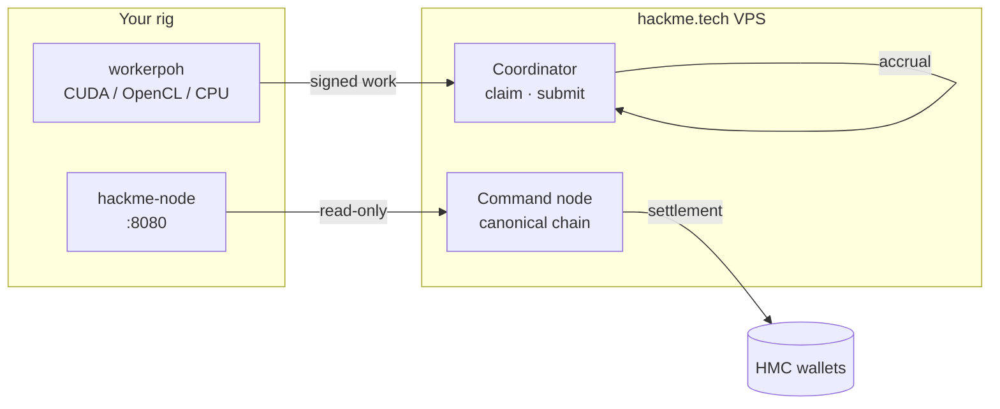

<div align="center">

<pre aria-label="HackMe Network ASCII logo">
██╗  ██╗ █████╗  ██████╗██╗  ██╗███╗   ███╗███████╗    ███╗   ██╗███████╗████████╗██╗    ██╗ ██████╗ ██████╗ ██╗  ██╗
██║  ██║██╔══██╗██╔════╝██║ ██╔╝████╗ ████║██╔════╝    ████╗  ██║██╔════╝╚══██╔══╝██║    ██║██╔═══██╗██╔══██╗██║ ██╔╝
███████║███████║██║     █████╔╝ ██╔████╔██║█████╗      ██╔██╗ ██║█████╗     ██║   ██║ █╗ ██║██║   ██║██████╔╝█████╔╝
██╔══██║██╔══██║██║     ██╔═██╗ ██║╚██╔╝██║██╔══╝      ██║╚██╗██║██╔══╝     ██║   ██║███╗██║██║   ██║██╔══██╗██╔═██╗
██║  ██║██║  ██║╚██████╗██║  ██╗██║ ╚═╝ ██║███████╗    ██║ ╚████║███████╗   ██║   ╚███╔███╔╝╚██████╔╝██║  ██║██║  ██╗
╚═╝  ╚═╝╚═╝  ╚═╝ ╚═════╝╚═╝  ╚═╝╚═╝     ╚═╝╚══════╝    ╚═╝  ╚═══╝╚══════╝   ╚═╝    ╚══╝╚══╝  ╚═════╝ ╚═╝  ╚═╝╚═╝  ╚═╝
</pre>

# HackMe Network

**Useful Proof-of-Work · public HTTP pool · WASM validation · GPU mining (CUDA / OpenCL)**

[](https://hackme.tech/downloads.html)
[](LICENSE)
[](https://go.dev/)
[](https://hackme.tech)
[](https://t.me/hackme_tech)
[](https://bitcointalk.org/index.php?topic=5583373.0)

[⬇ Downloads](https://hackme.tech/downloads.html) · [📊 Pool stats](https://hackme.tech/pool/coordinator/api/pool/stats) · [🔍 Explorer](https://hackme.tech/pool/explorer) · [📰 News](https://hackme.tech/news.html) · [📖 Docs](https://hackme.tech/docs.html) · [💰 Economics](https://hackme.tech/economics-model.html) · [🛡 Security](https://hackme.tech/security-rewards.html)

</div>

---

## What is HackMe?

HackMe is **open mining infrastructure**: a desktop **node** (dashboard + wallet view) and a **pool worker** (`workerpoh`) connect to the operator **coordinator** on [hackme.tech](https://hackme.tech). You submit verifiable nonce ranges; the pool accrues **off-chain HMC** credits. On-chain payouts arrive after **operator settlement** — not inside every PoH block.

| | |
|:---|:---|
| **Algorithm** | Useful PoW / WASM sandbox · dynamic `target_mod` |
| **Pool transport** | **HTTP coordinator** (not Stratum TCP) |
| **GPU** | NVIDIA **CUDA** · AMD/Intel **OpenCL** · CPU fallback |
| **License** | [Apache-2.0](LICENSE) — fork OK, **brand protection** applies |
| **Release** | **`0.1.0-rc11g`** — Windows installer + OpenCL for RX 580 |
| **Community** | [Telegram @hackme_tech](https://t.me/hackme_tech) · [Bitcointalk ANN](https://bitcointalk.org/index.php?topic=5583373.0) |

> **Miners:** Accrual on the coordinator ≠ wallet balance until settlement. Map your worker id → `HMC-…` in `WORKER_PAYOUT_MAP`.  
> [Economics](https://hackme.tech/economics-model.html) · [Network model](docs/NETWORK_MODEL.md)

---

## Architecture



| Component | Role |
|-----------|------|
| **Node** | Dashboard, explorer link, worker launcher, orders/fuzz API |
| **Worker** | Claims leases, submits results, hybrid Ed25519 when required |
| **Coordinator** | Fair leases, rate limits, payout ledger (off-chain) |
| **Site** | Downloads, SHA256, news RSS — [`web/site/`](web/site/) |

**Stress-tested:** 100 virtual workers · 10 min · 0% hard errors · stable RAM — see [docs/COORDINATOR_MEGA_STRESS.md](docs/COORDINATOR_MEGA_STRESS.md).

---

## Quick start

### Linux (public pool)

```bash
git clone https://github.com/jokeez/hackme.git && cd hackme

export HACKME_PUBLIC_AUTHORITY_BASE=https://hackme.tech
# export WORKER_PAYOUT_MAP=worker-$(hostname -s)=HMC-your-address

bash scripts/ops/desktop_mode_up.sh
```

Open **http://127.0.0.1:8080** → **Workers** → **Start pool worker**.

```bash
bash scripts/ops/desktop_mode_stop.sh   # stop
bash scripts/ops/restart_linux_desktop_worker.sh   # GPU-aware restart
```

### Windows

1. [Download **HackMe-Setup-0.1.0-rc11g.exe**](https://hackme.tech/downloads.html)  
2. Verify **SHA256** on the downloads page  
3. Run **Start HackMe Miner** (pool token preconfigured)  
4. **AMD RX 580:** installer selects **OpenCL** when `workerpoh-opencl.exe` is present  

### Build from source

```bash
go build -trimpath -o hackme-node .

go build -trimpath -tags opencl -o workerpoh-opencl ./cmd/workerpoh
go build -trimpath -o hackme-coordinator ./cmd/coordinator

VERSION=0.1.0-rc11g bash scripts/release/make_release_bundle.sh
```

---

## Documentation

| Doc | Topic |
|-----|--------|
| [docs/ARCHITECTURE.md](docs/ARCHITECTURE.md) | System design |
| [docs/NETWORK_MODEL.md](docs/NETWORK_MODEL.md) | VPS, workers, P2P, settlement |
| [docs/OPEN_POOL_MINERS.md](docs/OPEN_POOL_MINERS.md) | Miner setup |
| [docs/GPU_MINING_BACKENDS.md](docs/GPU_MINING_BACKENDS.md) | CUDA / OpenCL matrix |
| [docs/API.md](docs/API.md) | HTTP API |
| [docs/MININGPOOLSTATS_LISTING.md](docs/MININGPOOLSTATS_LISTING.md) | Pool listing |
| [docs/BITCOINTALK_ANN.md](docs/BITCOINTALK_ANN.md) | Forum ANN + [BBCode](docs/BITCOINTALK_ANN_BBCode.txt) |
| [docs/SECURITY_AUDIT_REDTEAM.md](docs/SECURITY_AUDIT_REDTEAM.md) | Red-team report |
| [scripts/release/README.md](scripts/release/README.md) | Release pipeline |

---

## Security & trust

| Check | Official |
|-------|----------|
| Website | **https://hackme.tech** only |
| Downloads | SHA256 on [downloads.html](https://hackme.tech/downloads.html) |
| Source | [github.com/jokeez/hackme](https://github.com/jokeez/hackme) |
| Reports | [contacts.html](https://hackme.tech/contacts.html) — no public 0-days |

```bash
bash scripts/ops/verify_project_health.sh
bash scripts/ops/public_release_readiness.sh
```

CI: [.github/workflows/ci.yml](.github/workflows/ci.yml)

---

## Contributing

See [CONTRIBUTING.md](CONTRIBUTING.md). Security: responsible disclosure via [hackme.tech/contacts.html](https://hackme.tech/contacts.html).

---

## License

Copyright © 2026 HackMe contributors · [Apache-2.0](LICENSE)
