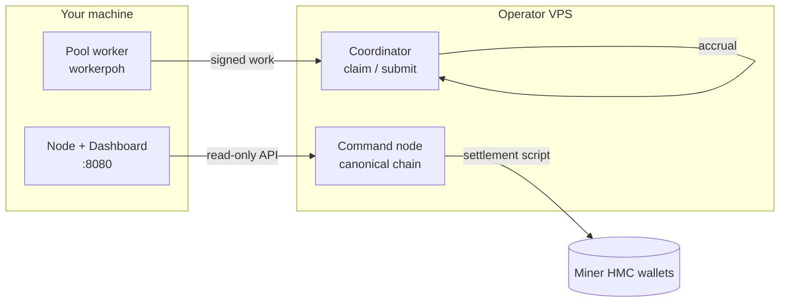

<div align="center">

# HackMe Network

**Useful Proof-of-Work infrastructure for pool mining, WASM validation, and operator-grade observability.**

[](https://hackme.tech/downloads.html)
[](LICENSE)
[](https://go.dev/)
[](https://hackme.tech)

[Downloads](https://hackme.tech/downloads.html) · [Pool Explorer](https://hackme.tech/pool/explorer) · [Documentation](https://hackme.tech/docs.html) · [Economics](https://hackme.tech/economics-model.html) · [Security rewards](https://hackme.tech/security-rewards.html) · [Security audit](docs/SECURITY_AUDIT_REDTEAM.md)

</div>

---

## At a glance

| | |
|:---|:---|
| **What** | Desktop **node** + **pool worker** + optional **coordinator** for fleet mining |
| **PoW model** | WASM sandbox · dynamic `poh_target_mod` · optional GPU (OpenCL/CUDA) |
| **Public pool** | [hackme.tech](https://hackme.tech) — coordinator accrual + on-chain settlement |
| **License** | [Apache-2.0](LICENSE) — fork-friendly, **attribution required** |
| **Status** | Release candidate `0.1.0-rc9` — production stack hardened (see [security](#security--open-source)) |

> **Miners:** Pool rewards accrue on the **coordinator** first. On-chain HMC arrives after **operator settlement** to your address in `WORKER_PAYOUT_MAP`. Block subsidies on the canonical chain credit the **producing node wallet**, not every GPU automatically.  
> Details → [economics model](https://hackme.tech/economics-model.html) · [network model](docs/NETWORK_MODEL.md)

---

## Architecture



| Component | Role |
|-----------|------|
| **Node** (`hackme-node`) | Dashboard, wallet, chain view, worker launcher, fuzz/orders API |
| **Worker** (`workerpoh`) | Claims nonce ranges, submits results to coordinator |
| **Coordinator** | Fair leases, hybrid signing, payout accounting (off-chain) |
| **Public site** | Static landing, downloads, checksums — [`web/site/`](web/site/) |

---

## Quick start

### Requirements

- **Go 1.22+**, `curl`, `jq` (ops scripts)
- **Linux** or **Windows** (release zip)
- GPU optional: OpenCL or CUDA dev libs for tagged builds

### Linux — join the public pool (recommended)

```bash
git clone https://github.com/jokeez/hackme.git && cd hackme

export HACKME_PUBLIC_AUTHORITY_BASE=https://hackme.tech
# Payout wallet (must match operator WORKER_PAYOUT_MAP for settlement):
# export WORKER_PAYOUT_MAP=worker-my-rig=HMC-your-address

bash scripts/ops/desktop_mode_up.sh
```

Open **http://127.0.0.1:8080** → **Mining** → **Start pool worker**.

```bash
# Stop
bash scripts/ops/desktop_mode_stop.sh
```

### Windows

1. Download from [hackme.tech/downloads.html](https://hackme.tech/downloads.html)  
2. Verify **SHA256** on the downloads page  
3. Run `start_hackme_public_pool.bat`  
4. See `RELEASE_QUICKSTART.md` inside the bundle  

### Build from source

```bash
go build -trimpath -o hackme-node .

# GPU (OpenCL):
go build -trimpath -tags opencl -o hackme-node .

go build -trimpath -o hackme-coordinator ./cmd/coordinator
```

Release artifacts:

```bash
VERSION=0.1.0-rc9 bash scripts/release/make_release_bundle.sh
bash scripts/release/verify_artifacts.sh dist/release_0.1.0-rc9
```

---

## Documentation

| Document | Description |
|----------|-------------|
| [docs/ARCHITECTURE.md](docs/ARCHITECTURE.md) | System design and data flow |
| [docs/NETWORK_MODEL.md](docs/NETWORK_MODEL.md) | VPS, workers, P2P, canonical follower |
| [docs/API.md](docs/API.md) | HTTP API reference |
| [docs/OPEN_POOL_MINERS.md](docs/OPEN_POOL_MINERS.md) | Miner setup guide |
| [SECURITY.md](SECURITY.md) | Vulnerability reporting (GitHub) |
| [docs/SECURITY.md](docs/SECURITY.md) | Threat model and hardening |
| [docs/SECURITY_AUDIT_REDTEAM.md](docs/SECURITY_AUDIT_REDTEAM.md) | Pre–open-source red-team report |
| [docs/PUBLIC_LAUNCH_VERDICT.md](docs/PUBLIC_LAUNCH_VERDICT.md) | Launch guarantees vs limits |
| [docs/TRADEMARK_AND_FORKING.md](docs/TRADEMARK_AND_FORKING.md) | **Protecting your brand when code is public** |
| [docs/BITCOINTALK_ANN.md](docs/BITCOINTALK_ANN.md) | Forum announcement + [BBCode paste](docs/BITCOINTALK_ANN_BBCode.txt) |
| [scripts/release/README.md](scripts/release/README.md) | Release pipeline |
| [docs/OPERATOR_VERDICT.md](docs/OPERATOR_VERDICT.md) | Production snapshot & settlement ops |
| [docs/MININGPOOLSTATS_LISTING.md](docs/MININGPOOLSTATS_LISTING.md) | Pool listing checklist |

---

## Security & open source

Publishing source code **does not** give anyone your servers, tokens, or domain. It **does** let others read and fork the code under the license.

| Risk | Mitigation |
|------|------------|
| **Fake pools / phishing** | Only trust **https://hackme.tech**, verify binary SHA256, check GitHub org |
| **Token / key theft** | Never commit `.secrets/`, `.env.desktop`, `data/*.db` — already in [`.gitignore`](.gitignore) |
| **Coordinator abuse** | Production uses admin token, found-only payout, hybrid signer strict — see [hardening example](scripts/ops/public_pool_hardening.env.example) |
| **Someone renames your project** | [Apache-2.0](LICENSE) requires **license + NOTICE**; **HackMe™ name/logo** are not open — see [TRADEMARK_AND_FORKING.md](docs/TRADEMARK_AND_FORKING.md) |
| **Exploits after publish** | [Responsible disclosure](https://hackme.tech/contacts.html) · [bug bounty tiers](docs/BUG_BOUNTY.md) (1–200 HMC) · audit: [SECURITY_AUDIT_REDTEAM.md](docs/SECURITY_AUDIT_REDTEAM.md) |

**Production checklist (operators):**

```bash
bash scripts/ops/verify_project_health.sh
bash scripts/ops/public_release_readiness.sh
NODE_SSH=hackme-vps bash scripts/ops/apply_security_hardening_vps.sh
```

CI: [.github/workflows/ci.yml](.github/workflows/ci.yml)

---

## Verify official software

| Check | Official |
|-------|----------|
| Website | `https://hackme.tech` |
| Downloads | `https://hackme.tech/downloads.html` |
| Pool explorer | `https://hackme.tech/pool/explorer` |
| Source (after you publish) | Your GitHub org only — link from the website |

If a fork uses the HackMe name, logo, or `hackme.tech` domain without permission — that is **trademark misuse**, not allowed by the license. See [docs/TRADEMARK_AND_FORKING.md](docs/TRADEMARK_AND_FORKING.md).

---

## Contributing

Contributions welcome under [CONTRIBUTING.md](CONTRIBUTING.md).  
Security issues: **do not** open public exploits — contact via [hackme.tech/contacts.html](https://hackme.tech/contacts.html). Accepted reports may receive small HMC grants per [docs/BUG_BOUNTY.md](docs/BUG_BOUNTY.md).

---

## License

Copyright © 2026 HackMe contributors.  
Licensed under the [Apache License, Version 2.0](LICENSE).
