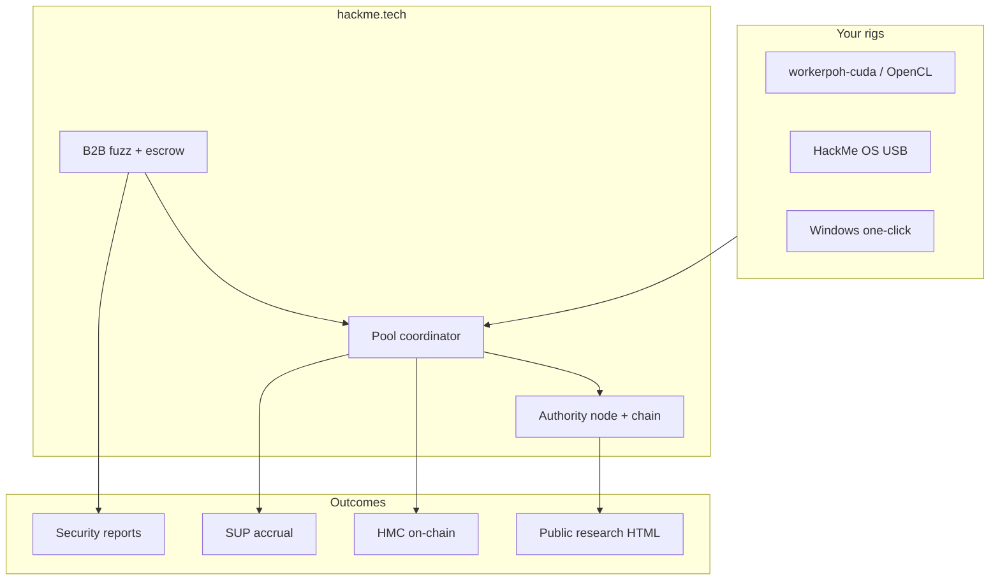

<div align="center">

<pre aria-label="HackMe Network ASCII logo">
██╗  ██╗ █████╗  █████╗ ██╗  ██╗███╗   ███╗███████╗    ███╗   ██╗███████╗████████╗██╗    ██╗ ██████╗ ██████╗ ██╗  ██╗
██║  ██║██╔══██╗██╔════╝██║ ██╔╝████╗ ████║██╔════╝    ████╗  ██║██╔════╝╚══██╔══╝██║    ██║██╔═══██╗██╔══██╗██║ ██╔╝
███████║███████║██║     █████╔╝ ██╔████╔██║█████╗      ██╔██╗ ██║█████╗     ██║   ██║ █╗ ██║██║   ██║██████╔╝█████╔╝
██╔══██║██╔══██║██║     ██╔═██╗ ██║╚██╔╝██║██╔══╝      ██║╚██╗██║██╔══╝     ██║   ██║███╗██║██║   ██║██╔══██╗██╔═██╗
██║  ██║██║  ██║╚██████╗██║  ██╗██║ ╚═╝ ██║███████╗    ██║ ╚████║███████╗   ██║   ╚███╔███╔╝╚██████╔╝██║  ██║██║  ██╗
╚═╝  ╚═╝╚═╝  ╚═╝ ╚═════╝╚═╝  ╚═╝╚═╝     ╚═╝╚══════╝    ╚═╝  ╚═══╝╚══════╝   ╚═╝    ╚══╝╚══╝  ╚═════╝ ╚═╝  ╚═╝╚═╝  ╚═╝
</pre>

# HackMe Network

### Useful Proof-of-Work · GPU mining pool · B2B security fuzz · public research ledgers

**Hash power that does real work** — WASM-gated useful PoW, coordinator accrual, on-chain settlement, and production fuzz campaigns on one stack.

<br/>

[](https://hackme.tech/downloads.html)
[](https://hackme.tech/pool/coordinator/api/pool/stats)
[-39ff14?style=for-the-badge&logo=shield&logoColor=white)](docs/SECURITY_AUDIT_REDTEAM.md)
[](https://github.com/jokeez/hackme/actions/workflows/ci.yml)
[](https://github.com/jokeez/hackme/actions/workflows/codeql.yml)
[](LICENSE)
[](https://hackme.tech)

<br/>

**[⬇ Downloads](https://hackme.tech/downloads.html)** · **[⚡ Quick start](docs/QUICK_START.md)** · **[⛏ Mine](docs/SETUP.md)** · **[🛡 Developers / Fuzz](https://hackme.tech/developers.html)** · **[📊 Pool stats](https://hackme.tech/pool/coordinator/api/pool/stats)** · **[🔬 Research](https://hackme.tech/research.html)** · **[📖 Docs](docs/INDEX.md)**

<br/>

| | |
|:---:|:---|
| **Coordinator** | `https://hackme.tech/pool/coordinator` |
| **Explorer** | [explorer-lite.html](https://hackme.tech/explorer-lite.html) |
| **Pool stats** | [api/pool/stats](https://hackme.tech/pool/coordinator/api/pool/stats) |
| **Source** | [github.com/jokeez/hackme](https://github.com/jokeez/hackme) |

</div>

---

## Why HackMe

Most “mining” is a lottery with no output. **HackMe ties hashrate to verifiable work:**

| Pillar | What you get |
|--------|----------------|
| **⛏ Mine** | Public HTTP pool · NVIDIA CUDA / OpenCL / CPU · hybrid Ed25519 submits · **HMC** rewards + **SUP** loyalty lane |
| **🛡 Fuzz** | B2B campaigns (`wasm_only` → `wasm_native`) · escrow · `fuzz_report_v2` · pool-distributed workers |
| **🔬 Research** | Bitcoin30 series · OSS CVE hunt · [nghttp2 14/14 CLEAN](https://hackme.tech/reports/oss-cve-watch/day14.html) · [libheif 14/14 CLEAN](https://hackme.tech/reports/oss-cve-watch-libheif/day14.html) |



> **Fair economics:** payout follows **accepted work** (`reward_per_m` × attempts), not lottery blocks.  
> Coordinator accrual → operator settlement → your `HMC-…` address. Details: [NETWORK_MODEL.md](docs/NETWORK_MODEL.md).

---

## Live stack (operator snapshot)

| Area | Status | Notes |
|------|--------|-------|
| **HMC pool** | **Live** | Auto `target_mod` · **~35 workers** · **~1005 GH/s** (operator snapshot 2026-08-29) · hybrid signer strict · public stats API live |
| **Settlement** | **Live** | HMC + SUP systemd timers + autopilot on canonical host |
| **B2B fuzz / PoH** | **Live** | Dashboard `#orders` · `workerfuzz` on hub · bootstrap PoH path (`pool_distributed` + `create_poh_order`) completing deep orders |
| **OSS CVE Watch · nghttp2** | **14/14 complete** | [day14.html](https://hackme.tech/reports/oss-cve-watch/day14.html) CLEAN · ~14.32B exec · ASAN=0 |
| **OSS CVE Watch · libheif** | **14/14 complete** | [day14.html](https://hackme.tech/reports/oss-cve-watch-libheif/day14.html) CLEAN · ~2.57B exec · ASAN=0 |
| **Win / Linux / fuzz / ISO** | **rc16** | SHA256 + apt + self-update on [downloads](https://hackme.tech/downloads.html) |
| **Security gate** | **16/16 PASS** (2026-08-28) | `security_full_audit.sh` + `redteam_hard_mode.sh` — [SECURITY_AUDIT_REDTEAM.md](docs/SECURITY_AUDIT_REDTEAM.md) |
| **HMS storage** | Preview | Prelaunch — not a miner lane yet |

Pool health probe: `bash scripts/ops/run_pool_health_check.sh` → `reports/pool-health-<ts>/`. Threat model: **[docs/SECURITY.md](docs/SECURITY.md)**.

---

## Ecosystem lanes

| Coin / lane | Role | Status | Start here |
|-------------|------|--------|------------|
| **HMC** | Primary PoW + pool settlement | **Live** | [OPEN_POOL_MINERS.md](docs/OPEN_POOL_MINERS.md) |
| **SUP** | Support accrual while mining HMC | **Live** | [SUPPORT_COIN_UTILITY.md](docs/SUPPORT_COIN_UTILITY.md) |
| **B2B fuzz** | Paid security campaigns | **Live** | [FUZZ_PRODUCT_GUIDE.md](docs/FUZZ_PRODUCT_GUIDE.md) |
| **HMS** | Storage + seal epochs | Preview | [HMS_PUBLIC_ROADMAP.md](docs/HMS_PUBLIC_ROADMAP.md) |

---

## Quick start

<table>
<tr>
<td width="33%" valign="top">

### Linux

```bash
git clone https://github.com/jokeez/hackme.git
cd hackme
cp .env.desktop.example .env.desktop
bash scripts/ops/desktop_mode_up.sh
```

Open **http://127.0.0.1:8080** → **Workers** → start pool GPU.

[Full setup →](docs/SETUP.md)

</td>
<td width="33%" valign="top">

### Windows

1. [Download installer](https://hackme.tech/downloads.html)
2. Verify **SHA256** on that page
3. **Start HackMe Miner** from Start menu

[Windows guide →](docs/MINER_WINDOWS_ONE_CLICK.md)

</td>
<td width="33%" valign="top">

### HackMe OS

Flash **HackMe-OS** ISO from downloads → boot rig → wallet + mining autostart.

```bash
bash scripts/tests/verify_hackme_iso.sh your.iso
```

[OS guide →](docs/HACKME_OS.md)

</td>
</tr>
</table>

**GPU reference:** RTX 5060 Ti class ~30–40 GH/s · field RTX 5090 ~140 GH/s — see [GPU_MINING_BACKENDS.md](docs/GPU_MINING_BACKENDS.md).

---

## B2B security fuzz

| Package | HMC | Runs | exec/unit | Pool |
|---------|-----|------|-----------|------|
| **scan** | ~1 | 64 | 1 | local |
| **audit** | ~5 | 256 | 64 | yes |
| **deep** | ~25 | 2048 | 512 local · **64 cap on hub** | yes |

**Packs:** `secrets` · `script_bounds` · `filter_utf8` (FluxTap-class filter POC) · `parser_expat`

**Hunt** (Phase 2 on `feature/hunt-mvp`): repo + ASAN, **50/50** escrow, inventory **C/C++/Rust Phase A** — [HUNT_ECONOMICS.md](docs/HUNT_ECONOMICS.md) · [HUNT_RUST_PHASE_A.md](docs/HUNT_RUST_PHASE_A.md) (`serde_json`, `memchr`, `quick_xml`).

```bash
hackme-fuzzing wizard --pack filter_utf8 --package audit   # local node only
```

- [developers.html](https://hackme.tech/developers.html) · [fuzz-guide.html](https://hackme.tech/fuzz-guide.html) — public landing  
- [FUZZ_PRODUCT_GUIDE.md](docs/FUZZ_PRODUCT_GUIDE.md) — Dig + Hunt packages, coverage, pool anticheat  
- [CUSTOMER_FUZZ_DELIVERABLES.md](docs/CUSTOMER_FUZZ_DELIVERABLES.md) — Dig reports & repro  
- Hybrid pool: `workerpoh` + fuzz claim/submit; coordinator **replays** segments (not miner attestation)  
- Dig escrow fee **20%** on pool campaigns; Hunt uses **50/50** — see economics docs

**Coverage honesty:** `wasm_edge_bitmap` @ WASM mem offset **8192** is guided scheduling — **not** AFL/libFuzzer edges (OSS research + Hunt catalog ASAN use native sanitizers separately).

---

## Research & transparency

| Series | Public hub |
|--------|------------|
| **Bitcoin Core 30-day fuzz** | [bitcoin30.html](https://hackme.tech/reports/bitcoin30.html) |
| **OSS CVE matrix** | [oss-cve/](https://hackme.tech/reports/oss-cve/) |
| **OSS CVE Watch · nghttp2** (complete) | [oss-cve-watch/](https://hackme.tech/reports/oss-cve-watch/) · [Day 14 finale · CLEAN](https://hackme.tech/reports/oss-cve-watch/day14.html) |
| **OSS CVE Watch · libheif** (complete) | [oss-cve-watch-libheif/](https://hackme.tech/reports/oss-cve-watch-libheif/) · [Day 14 finale · CLEAN](https://hackme.tech/reports/oss-cve-watch-libheif/day14.html) |
| **L1 / B2B case studies** | [research.html](https://hackme.tech/research.html) |

**nghttp2 series (closed):** Day 14 finale **3.03B** exec · 17.0h · ASAN=0 · Days 2–14 cum ≈ **14.32B** — [series verdict](docs/verdicts/OSS_CVE_WATCH_NGHTTP2_SERIES_VERDICT.md).

**libheif series (closed):** Days **1–14 CLEAN** · ~**2.57B** exec · ~325h ASAN · ASAN=0 — [runbook](docs/OSS_CVE_LIBHEIF_SERIES.md) · [finale](https://hackme.tech/reports/oss-cve-watch-libheif/day14.html).

Run locally: `DAY=8 bash scripts/ops/run_bitcoin30_day.sh` · [BITCOIN30_SERIES.md](docs/BITCOIN30_SERIES.md)

---

## Build & verify

```bash
go build -trimpath -o hackme-node .
go build -trimpath -tags opencl -o workerpoh-opencl ./cmd/workerpoh
go test ./...
bash scripts/tests/public_site_smoke.sh
bash scripts/tests/version_consistency_gate.sh
```

Release bundle: `VERSION=0.1.0-rc16 bash scripts/release/make_release_bundle.sh` — [scripts/release/README.md](scripts/release/README.md)

---

## Configuration

| File | Purpose |
|------|---------|
| `.env.desktop` | Local node + dashboard |
| `hackme.env` | Windows miner (installer) |
| `.secrets/*` | **Never commit** — tokens & seeds |
| `WORKER_PAYOUT_MAP` | `worker_id=HMC-…` for settlement |

→ [SECURITY_REPO.md](docs/SECURITY_REPO.md) before every push

---

## Documentation map

| Doc | Audience |
|-----|----------|
| [docs/INDEX.md](docs/INDEX.md) | Full map |
| [docs/SETUP.md](docs/SETUP.md) | Miners |
| [docs/API.md](docs/API.md) | Integrators |
| [docs/ARCHITECTURE.md](docs/ARCHITECTURE.md) | System design |
| [docs/SECURITY.md](docs/SECURITY.md) | Threat model |

---

## Security & trust

| | |
|--|--|
| **Official site** | https://hackme.tech only |
| **Downloads** | SHA256 on [downloads.html](https://hackme.tech/downloads.html) |
| **Disclosure** | [contacts.html](https://hackme.tech/contacts.html) |
| **Bug bounty** | [BUG_BOUNTY.md](docs/BUG_BOUNTY.md) |

---

## Contributing

[CONTRIBUTING.md](CONTRIBUTING.md) — AGPL-3.0 · respect [TRADEMARK.md](TRADEMARK.md) · no secrets in git.

---

<div align="center">

**HackMe Network** — useful work, open code, honest economics.

<br/>

[](https://t.me/hackme_tech)
[](https://bitcointalk.org/index.php?topic=5583373.0)

<br/>

<sub>Copyright © 2026 HackMe contributors · <a href="LICENSE">AGPL-3.0</a></sub>

</div>
