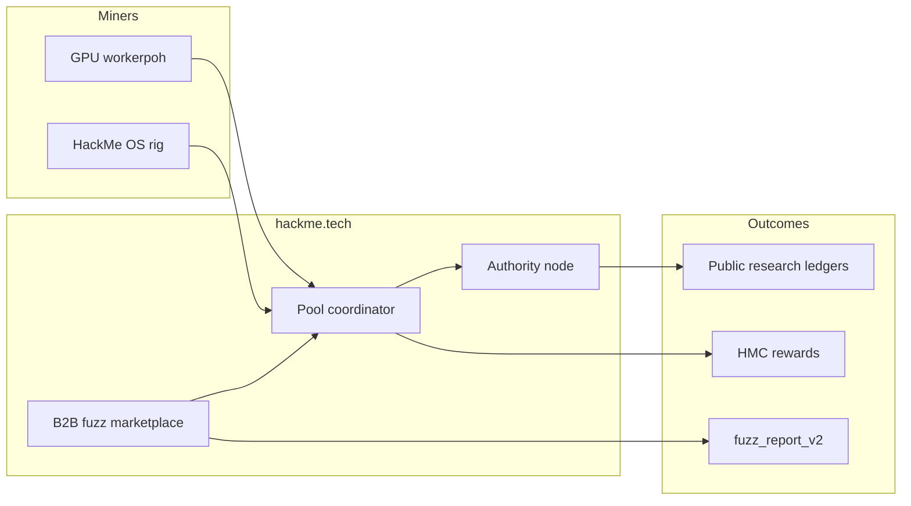

<div align="center">

<pre aria-label="HackMe Network ASCII logo">
██╗  ██╗ █████╗  █████╗ ██╗  ██╗███╗   ███╗███████╗    ███╗   ██╗███████╗████████╗██╗    ██╗ ██████╗ ██████╗ ██╗  ██╗
██║  ██║██╔══██╗██╔════╝██║ ██╔╝████╗ ████║██╔════╝    ████╗  ██║██╔════╝╚══██╔══╝██║    ██║██╔═══██╗██╔══██╗██║ ██╔╝
███████║███████║██║     █████╔╝ ██╔████╔██║█████╗      ██╔██╗ ██║█████╗     ██║   ██║ █╗ ██║██║   ██║██████╔╝█████╔╝
██╔══██║██╔══██║██║     ██╔═██╗ ██║╚██╔╝██║██╔══╝      ██║╚██╗██║██╔══╝     ██║   ██║███╗██║██║   ██║██╔══██╗██╔═██╗
██║  ██║██║  ██║╚██████╗██║  ██╗██║ ╚═╝ ██║███████╗    ██║ ╚████║███████╗   ██║   ╚███╔███╔╝╚██████╔╝██║  ██║██║  ██╗
╚═╝  ╚═╝╚═╝  ╚═╝ ╚═════╝╚═╝  ╚═╝╚═╝     ╚═╝╚══════╝    ╚═╝  ╚═══╝╚══════╝   ╚═╝    ╚══╝╚══╝  ╚═════╝ ╚═╝  ╚═╝╚═╝  ╚═╝
</pre>

# HackMe Network

**Useful Proof-of-Work · public HTTP pool · GPU mining · B2B security fuzz**

[](https://hackme.tech/downloads.html)
[](docs/STATUS.md)
[](LICENSE)
[](https://hackme.tech)

[Downloads](https://hackme.tech/downloads.html) · [Research](https://hackme.tech/research.html) · [Developers](https://hackme.tech/developers.html) · [Pool stats](https://hackme.tech/pool/coordinator/api/pool/stats) · [Explorer](https://hackme.tech/explorer-lite.html) · [Docs index](docs/INDEX.md)

</div>

---

## At a glance

| | |
|:---|:---|
| **What** | Open mining + security-fuzz infrastructure — hash power runs real WASM guards, not empty lottery work |
| **Pool** | HTTP coordinator on [hackme.tech](https://hackme.tech) · dynamic `target_mod` · hybrid Ed25519 |
| **GPU** | NVIDIA CUDA · AMD/Intel OpenCL · CPU fallback · up to **~123 GH/s** on reference RTX rig |
| **Coins** | **HMC** live pool · **SUP** accrual lane · **HMS** storage preview (prelaunch) |
| **Release** | **`0.1.0-rc11r`** — Windows installer, Linux tarball, fuzz CLI, HackMe OS ISO |
| **Security** | **16/16** full audit PASS · public red-team gates · locked WASM sandbox |
| **License** | [AGPL-3.0](LICENSE) · [Trademark](TRADEMARK.md) |

> Dashboard wallet balance ≠ pool payout until operator settlement. Map `WORKER_ID` → `HMC-…` with the operator. See [docs/NETWORK_MODEL.md](docs/NETWORK_MODEL.md).

---

## Ecosystem



| Lane | Status | Docs |
|------|--------|------|
| **HMC** mining pool | Live | [OPEN_POOL_MINERS.md](docs/OPEN_POOL_MINERS.md) |
| **SUP** support accrual | Live | [SUPPORT_COIN_UTILITY.md](docs/SUPPORT_COIN_UTILITY.md) |
| **B2B fuzz** (orders + pool) | Live | [FUZZ_PRODUCT_GUIDE.md](docs/FUZZ_PRODUCT_GUIDE.md) |
| **HMS** storage + seal | Preview | [HMS_PUBLIC_ROADMAP.md](docs/HMS_PUBLIC_ROADMAP.md) |

---

## Quick start (5 minutes)

### Linux

```bash
git clone https://github.com/jokeez/hackme.git && cd hackme
cp .env.desktop.example .env.desktop    # edit WORKER_PAYOUT_MAP + optional tokens
bash scripts/ops/desktop_mode_up.sh
```

Open **http://127.0.0.1:8080** → **Workers** → start pool worker.  
Full guide: **[docs/SETUP.md](docs/SETUP.md)**

### Windows

1. [Download installer](https://hackme.tech/downloads.html) — verify SHA256 on that page  
2. Run **Start HackMe Miner** from Start menu  

### HackMe OS (USB rig)

Flash ISO from downloads → boot **HackMe OS** → wallet + mining auto-start.  
Verify: `bash scripts/tests/verify_hackme_iso.sh your.iso`

---

## B2B security fuzz

Integrators run campaigns via the local node dashboard (`#orders` → `#fuzz`) or the public developer portal.

| Tier | Depth | Typical use |
|------|-------|-------------|
| `wasm_only` | Fast WASM guard scan | CI smoke, daily guards |
| `wasm_native` | WASM → native bridge confirm | Bounty-grade triage |
| `bytes_corpus` | Structured byte inputs | Deep corpus passes |

- Product guide: [docs/FUZZ_PRODUCT_GUIDE.md](docs/FUZZ_PRODUCT_GUIDE.md)  
- Deliverables: [docs/CUSTOMER_FUZZ_DELIVERABLES.md](docs/CUSTOMER_FUZZ_DELIVERABLES.md)  
- Public landing: [hackme.tech/developers.html](https://hackme.tech/developers.html)

---

## Research & public ledgers

| Series | Hub | Social copy |
|--------|-----|-------------|
| **Bitcoin Core 30-day fuzz** | [bitcoin30.html](https://hackme.tech/reports/bitcoin30.html) | [docs/SOCIAL_BTC30_POSTS.md](docs/SOCIAL_BTC30_POSTS.md) |
| **OSS CVE hunt** | [oss-cve/](https://hackme.tech/reports/oss-cve/) | — |
| **L1 crypto stack** | [research.html](https://hackme.tech/research.html) | — |

Run a BTC30 day locally: `DAY=8 bash scripts/ops/run_bitcoin30_day.sh` — see [docs/BITCOIN30_SERIES.md](docs/BITCOIN30_SERIES.md).

---

## Configuration (never commit secrets)

| File | Purpose |
|------|---------|
| `.env.desktop` | Local node + dashboard (`HACKME_ADMIN_TOKEN`, pool URL) |
| `hackme.env` | Windows miner env beside `hackme.exe` (installer writes this) |
| `.secrets/hackme_coordinator_worker_token` | Pool worker token |
| `.secrets/hackme_coordinator_admin_token` | Operators only |
| `HACKME_MINER_ED25519_SEED_HEX` | Per-rig signing key (`minersign -gen-seed`) |

Templates: `.env.desktop.example`, `scripts/ops/worker.env.example`.  
Before pushing: [docs/SECURITY_REPO.md](docs/SECURITY_REPO.md)

---

## Build from source

```bash
go build -trimpath -o hackme-node .
go build -trimpath -tags opencl -o workerpoh-opencl ./cmd/workerpoh
go build -trimpath -o hackme-coordinator ./cmd/coordinator
VERSION=0.1.0-rc11r bash scripts/release/make_release_bundle.sh
```

---

## Health checks

```bash
bash scripts/ops/verify_project_health.sh
bash scripts/tests/public_site_smoke.sh
bash scripts/ops/run_miner_launch_gate.sh    # operators — RC gate
```

Current RC snapshot: [docs/STATUS.md](docs/STATUS.md) · detail: [docs/HACKME_RC11R.md](docs/HACKME_RC11R.md)

---

## Documentation

| | |
|--|--|
| [docs/INDEX.md](docs/INDEX.md) | Full documentation map |
| [docs/SETUP.md](docs/SETUP.md) | Install paths (Linux / Windows / ISO) |
| [docs/API.md](docs/API.md) | HTTP API reference |
| [docs/ARCHITECTURE.md](docs/ARCHITECTURE.md) | System design |
| [scripts/release/README.md](scripts/release/README.md) | Release pipeline |

---

## Security

| | |
|--|--|
| Official site | **https://hackme.tech** only |
| Downloads | SHA256 on [downloads.html](https://hackme.tech/downloads.html) |
| Vulnerabilities | [contacts.html](https://hackme.tech/contacts.html) — responsible disclosure |
| Bug bounty | [docs/BUG_BOUNTY.md](docs/BUG_BOUNTY.md) |

---

## Contributing

See [CONTRIBUTING.md](CONTRIBUTING.md). Do not commit `.env`, `.secrets`, `hackme.env`, `data/`, or `logs/` ([`.gitignore`](.gitignore)).

---

## License

Copyright © 2026 HackMe contributors · [AGPL-3.0](LICENSE)
