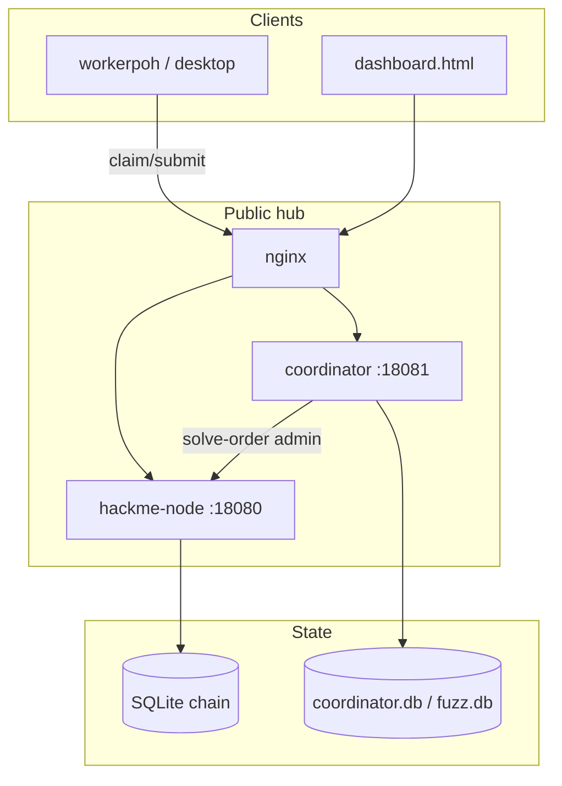

# HackMe Architecture (current)

**HackMe Network** · `0.1.0-rc15` · [hackme.tech](https://hackme.tech) · [Telegram](https://t.me/hackme_tech)

> **Note:** Older “one process / loopback-only / optional admin” wording was an early MVP snapshot. Production hub is multi-process with admin-required mutating routes.

## Review

Public hub runs **two Go binaries** (same tree):

| Process | Role |
|---------|------|
| `hackme-node` | Chain SQLite ledger, wallet/transfers, orders (`/api/tasks`, `/api/poh/solve-order`), dashboard, P2P |
| `coordinator` (`cmd/coordinator`) | Pool claim/submit, hybrid signer, SUP accrual, fuzz pool |

Miners typically run **`workerpoh`** (or desktop worker profile) against `https://hackme.tech/pool/coordinator`. Local WASM gates use the wazero sandbox.

**Security (production defaults):**

- Bind via `HACKME_BIND_ADDR` (often `0.0.0.0` behind nginx; prefer loopback + reverse proxy)
- **`HACKME_ADMIN_TOKEN` required** for mutating admin routes (`requireAdminAuthStrict` on money/sync/genesis paths)
- Pool workers use coordinator worker token; hybrid ed25519 PoP for payouts
- P2P state replay (followers): needs `HACKME_P2P_SYNC_STATE_REPLAY_ENABLED=1` **and** `HACKME_P2P_LEADER_PUBKEYS`

Threat model: [`docs/SECURITY.md`](SECURITY.md). Network shape: [`docs/NETWORK_MODEL.md`](NETWORK_MODEL.md) if present, else site roadmap.

## Related

- Release channel: [`HACKME_RC15.md`](HACKME_RC15.md)
- Orders economics: [`ORDER_ECONOMICS.md`](ORDER_ECONOMICS.md)
- Pool threats: [`POOL_SECURITY_THREATS_VERDICT.md`](POOL_SECURITY_THREATS_VERDICT.md)
