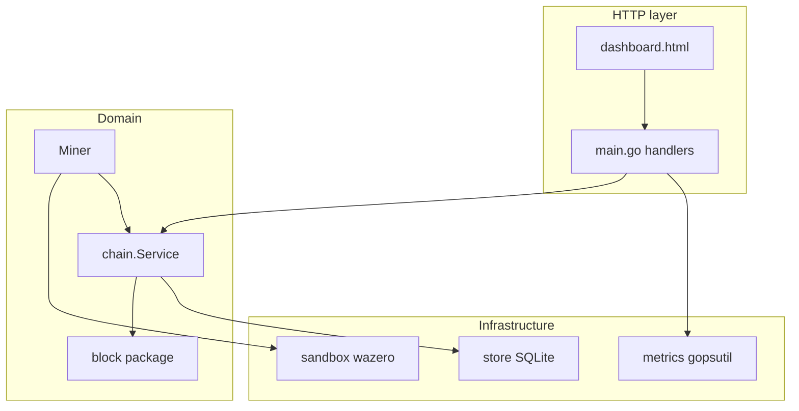

# HackMe Architecture (MVP)

**HackMe Network** · `0.1.0-rc13` · [hackme.tech](https://hackme.tech) · [Telegram](https://t.me/hackme_tech)

## Review

One Go process brings up the HTTP server. The state of the chain and wallet is stored in **SQLite**. Heavy or isolated things: collecting OS metrics, executing **WASM** in a separate wazero runtime, background miner.

**Security (MVP):** listener only **`127.0.0.1`**; optional **`HACKME_ADMIN_TOKEN`** + `requireAdminAuth` in `admin_auth.go` for selected POSTs. Threat model: **`docs/SECURITY.md`**.

## Packages `internal/`

| Package | Responsibility |
|-------|-----------------|
| `block` | Block and Task DTO, Canonical JSON for Hash, SHA-256, Genesis Factory |
| `chain` | Database transactions: genesis, **AppendPoHBlock**, wallet, list of blocks, tip; table **`tasks`** + **StoreTaskProvider** (priority of paid orders over `File`/`Internal`); miner orchestration |
| `store` | Opening SQLite, DDL migrations |
| `sandbox` | Compile/instance WASM, call `eval` |

## Flow: genesis

1. Client `POST /api/genesis`.
2. `chain.Service.InitGenesis` under mutex: checking for the absence of block 0 → `block.NewGenesisBlock` (miner = node) → `INSERT` block + primary `wallet` + `accounts` (mint on `DevFeeAddress` with non-zero `GenesisRewardHMC`) + meta.
3. JSON response; the server writes the full JSON block to stdout.

## Stream: mining

1. `POST /api/mining/start` (after genesis).
2. Active task: snapshot `TaskProvider.Snapshot` (every ~2 s and at start) - built-in synthetics or the last one `tasks/*.json`; the reward from the manifest can replace the miner's default.
3. Pool of workers `runtime.NumCPU()`: native search `n*7+13` in batches; log/console - ticker **2 s**; `sandbox.Eval` once per found nonce (verification).
4. Victory condition: `eval(nonce) % M == 0` for the current `M` from `meta.poh_target_mod` → `AppendPoHBlock` (new block, update `tip_hash`, retarget `M` **every 5 blocks** window ~30 s/block, reward from miner) → reset the attempt counter, **search continues** until `POST /api/mining/stop`.
5. UI: metrics `GET /api/metrics` (~2 s); mining logs - **SSE** `GET /api/mining/logs/stream` with active PoH, otherwise rollback to `GET /api/mining/logs`.

## External dependencies

- `github.com/shirou/gopsutil/v3` — CPU/RAM/disk/net.
- `modernc.org/sqlite` - database without CGO.
- `github.com/tetratelabs/wazero` — WASM.

## What is intentionally not done

- There is no separate node and worker process: everything is in one binary.
- No P2P: “peers” in the UI is a placeholder for the future.
