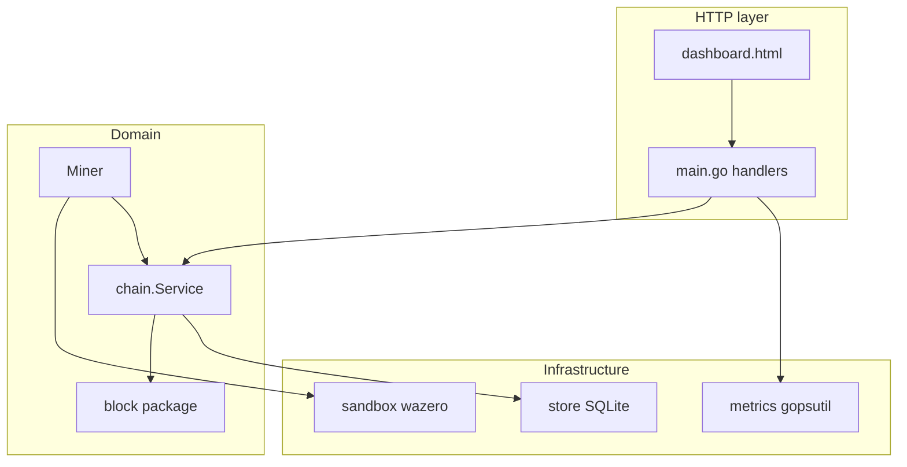

# Архитектура HackMe (MVP)

**HackMe Network** · `0.1.0-rc11g` · [hackme.tech](https://hackme.tech) · [Telegram](https://t.me/hackme_tech)

## Обзор

Один процесс Go поднимает HTTP-сервер. Состояние цепи и кошелька хранится в **SQLite**. Тяжёлые или изолированные вещи: сбор метрик ОС, исполнение **WASM** в отдельном рантайме wazero, фоновый майнер.

**Безопасность (MVP):** слушатель только **`127.0.0.1`**; опционально **`HACKME_ADMIN_TOKEN`** + `requireAdminAuth` в `admin_auth.go` для выбранных POST. Модель угроз и чеклист перед выходом в сеть — **`docs/SECURITY.md`**.

## Пакеты `internal/`

| Пакет | Ответственность |
|-------|-----------------|
| `block` | DTO блока и задачи, канонический JSON для хэша, SHA-256, фабрика генезиса |
| `chain` | Транзакции с БД: генезис, **AppendPoHBlock**, кошелёк, список блоков, tip; таблица **`tasks`** + **StoreTaskProvider** (приоритет платных заказов над `File`/`Internal`); оркестрация майнера |
| `store` | Открытие SQLite, миграции DDL |
| `sandbox` | Компиляция/инстанс WASM, вызов `eval` |

## Поток: генезис

1. Клиент `POST /api/genesis`.
2. `chain.Service.InitGenesis` под mutex: проверка отсутствия блока 0 → `block.NewGenesisBlock` (miner = нода) → `INSERT` блок + primary `wallet` + `accounts` (mint на `DevFeeAddress` при ненулевом `GenesisRewardHMC`) + meta.
3. Ответ JSON; сервер пишет в stdout полный JSON блока.

## Поток: майнинг

1. `POST /api/mining/start` (после генезиса).
2. Активная задача: снимок `TaskProvider.Snapshot` (раз в ~2 с и при старте) — встроенная синтетика или последний `tasks/*.json`; награда из манифеста может подменять дефолт майнера.
3. Пул воркеров `runtime.NumCPU()`: нативный перебор `n*7+13` батчами; лог/консоль — тикер **2 с**; `sandbox.Eval` один раз на найденный nonce (верификация).
4. Условие победы: `eval(nonce) % M == 0` для текущего `M` из `meta.poh_target_mod` → `AppendPoHBlock` (новый блок, обновление `tip_hash`, ретаргет `M` **каждые 5 блоков** по окну ~30 с/блок, награда из майнера) → сброс счётчика попыток, **поиск продолжается** до `POST /api/mining/stop`.
5. UI: метрики `GET /api/metrics` (~2 с); логи майнинга — **SSE** `GET /api/mining/logs/stream` при активном PoH, иначе откат на `GET /api/mining/logs`.

## Зависимости внешние

- `github.com/shirou/gopsutil/v3` — CPU/RAM/disk/net.
- `modernc.org/sqlite` — БД без CGO.
- `github.com/tetratelabs/wazero` — WASM.

## Что намеренно не сделано

- Нет отдельного процесса ноды и воркера: всё в одном бинарнике.
- Нет P2P: «peers» в UI — заглушка для будущего.
