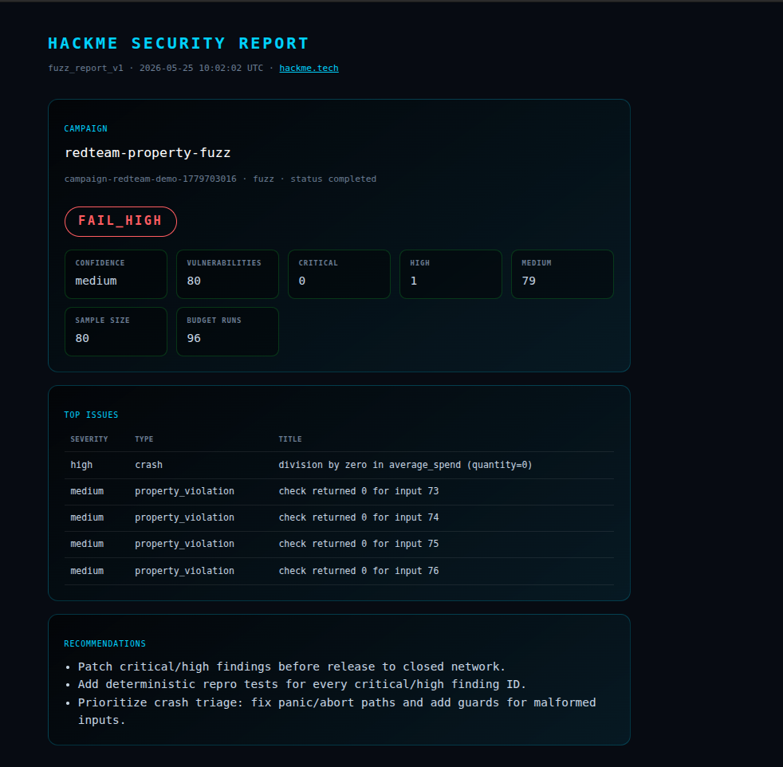
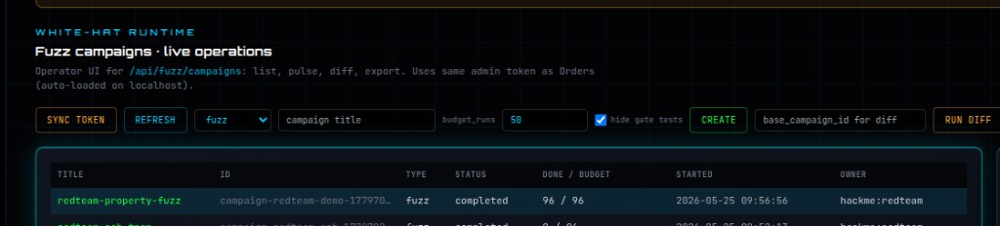

# HackMe Security Note #1 — Script push bounds (research)

**Published:** 2026-05-25 · **License:** AGPL-3.0 · **Pool:** [hackme.tech](https://hackme.tech)

## Summary

HackMe ran **Security Research Campaign #1**: a useful Proof-of-Work order where miners search for inputs where a WASM `check(i64) -> i32` flags a **consensus-style violation class** — `OP_PUSHDATA1` (`0x4c`) with claimed push length **> 520 bytes** (simplified from Bitcoin Script element-size rules).

| Item | Value |
|------|--------|
| Guard source | [`tasks/sources/security/rust_script_push_bounds_guard.rs`](../../tasks/sources/security/rust_script_push_bounds_guard.rs) |
| Useful-PoW order | `order-security-script-push-001` (completed on coordinator) |
| Fuzz campaign (demo) | `security-note-01` → verdict **clean** (expected for a working guard) |
| HTML fuzz reports | `GET /api/fuzz/campaigns/{id}/report` returns styled HTML by default |

**This is not** a claim of a new vulnerability in **Bitcoin Core**. It is a **reproducible research demo** on HackMe open infrastructure (same stack as the live HMC pool and B2B fuzzing).

## Screenshots

### HTML fuzz report (operator view)

Styled report page: verdict badge, metrics, top issues, recommendations. Example below is a **property-fuzz demo** on `rust_bounds_guard` (`FAIL_HIGH`) — shows the report UX when findings exist.



### Fuzz campaigns dashboard

White-hat runtime UI: list campaigns, pulse, export, **Open report** (HTML).



## Checker (full source)

```rust
// tasks/sources/security/rust_script_push_bounds_guard.rs
#![no_std]

use core::panic::PanicInfo;

#[panic_handler]
fn panic(_info: &PanicInfo) -> ! {
    loop {}
}

/// Simplified Bitcoin Script push-size rule (educational / research gate).
/// Input packs: opcode in low byte, claimed push length in bits 8..23.
/// Returns 1 when the tuple violates the "max push element 520 bytes" style bound.
#[no_mangle]
pub extern "C" fn check(n: i64) -> i32 {
    if n <= 0 {
        return 0;
    }
    let op = (n & 0xff) as u32;
    let claimed_len = ((n >> 8) & 0xffff) as u32;
    if op == 0x4c && claimed_len > 520 {
        1
    } else {
        0
    }
}
```

## Reproduce locally

```bash
git clone https://github.com/jokeez/hackme.git && cd hackme
bash scripts/build_security_task_pack.sh
bash scripts/ops/run_security_research_campaign.sh
bash scripts/ops/bootstrap_security_fuzz_campaign.sh
# Desktop node: Fuzz tab → security-note-01 → Open report
```

API: `GET /api/fuzz/campaigns/{id}/report` (HTML) · `?format=json` for automation · `GET …/report.html` same HTML.

## Honest notes on findings

- **`FAIL_HIGH` screenshot** — demo property-fuzz on `rust_bounds_guard` (many `check returned 0` hits). **Not** “80 bugs in Bitcoin Core”.
- **Security Note #1** push-bound fuzz sample was **clean** — the guard behaves as intended on that campaign.
- **Red-team OOB hex** campaigns may show sandbox quarantine noise; use `MODE=bounds` in `scripts/ops/run_fuzz_redteam_oob_campaign.sh` for meaningful property findings.

## Links

- [Developers / B2B fuzzing](https://hackme.tech/developers.html)
- [Pool stats](https://hackme.tech/pool/coordinator/api/pool/stats)
- [Bitcointalk ANN](https://bitcointalk.org/index.php?topic=5583373.0)
- [Telegram @hackme_tech](https://t.me/hackme_tech)

## Related docs

- [Security research campaign runbook](../SECURITY_RESEARCH_CAMPAIGN_01.md)
- [Screenshot & post checklist](../SCREENSHOT_AND_POST_CHECKLIST.md)
- Forum thread: https://bitcointalk.org/index.php?topic=5583373.0 (reply with link to this pack)
